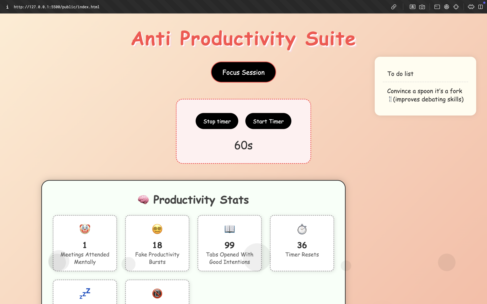
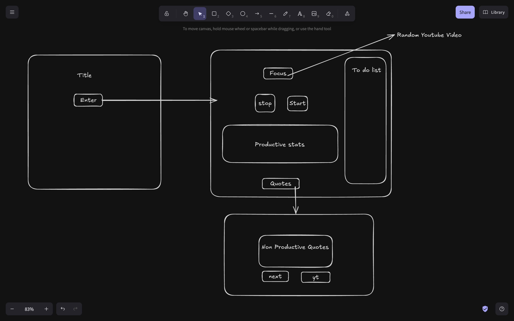

# ProcrastiMate

## Basic Details
### Team Name: Aswanth Madhav 

### Team Members
- Team Lead: Aswanth Madhav - Model Engineering College

### Project Description
A productivity-ish platform with a feel-good vibe. Set a timer, laugh at dumb quotes, and check off the most useless to-dos ever written — all while pretty bubbles float around you.

### The Problem (that doesn't exist)
Sometimes productivity apps are too productive. Like chill, Karen — maybe I just wanna stare at the screen and vibe.

### The Solution (that nobody asked for)
An aesthetic, slow-moving, dopamine-boosting page where you can pretend to be productive while actually doing... nothing. Floaty bubbles, useless quotes, and to-dos like “touch grass” await. That makes you feel that Five star is right 

## Technical Details
### Technologies/Components Used
For Software:
- Languages: HTML, CSS, JavaScript

- Frameworks: None, raw chaos only

- Libraries : None

- Tools: VS Code, GitHub, Copilot whispering sweet nonsense

### Implementation
For Software:
# Installation
git clone https://github.com/aswanthmadav/ProcrastiMate.git
cd ProcrastiMate
open hero.html

# Run
Just open hero.html in a browser. We believe in ✨ low effort ✨.

### Project Documentation
For Software:

# Screenshots (Add at least 3)
![Screenshot1] 
Time flies when you’re pretending to work.

![Screenshot2]
THis is where you can hallucinate that you are working , or aybe show your parents you are . 

![Screenshot3]
Highly motivating quotes 

# Diagrams
![Workflow]
When you press the start button on the hero page , it redirects you to the main page , in the main page when you press the focus button , it redirects you to a random yt video which is decided by the js working behind , the to do list auto updates with random to dos with the help of js  , the stats container gives random stats , the timer works in a qwerky way ,with the help of js which changes the time . 

### Project Demo
# Video
https://youtu.be/rEIOjyGuVs4

So it all starts with you looking at the hero page , which you might thing i repeat might think that the meme is good , and there is a button screaming at you to click it , then you are redirected to the main page where you see the stairs to heaven of productivity , the focus session , a timer , productivity stats , quotes , to do list , what else could you need , the only thing is they wont work as you intend them to , so basically useless , but is it ? and then you redirected to the motivational quotes page, which will motivate you to do nothing , and again five star wins . 

## Team Contributions
- Aswanth Madhav: Full contribution

---
Made with ❤️ at TinkerHub Useless Projects 

